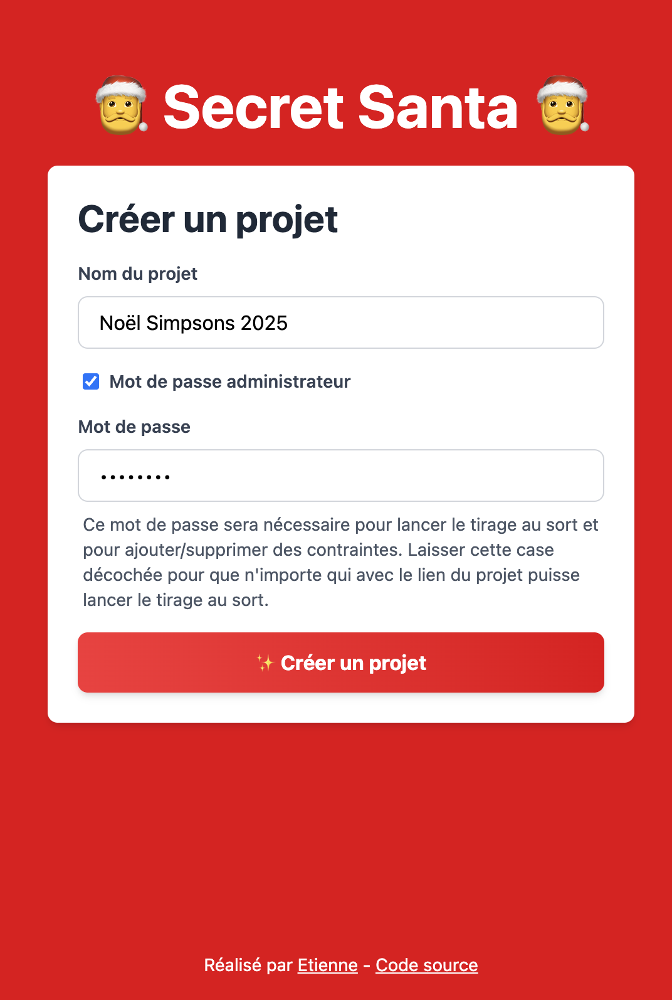
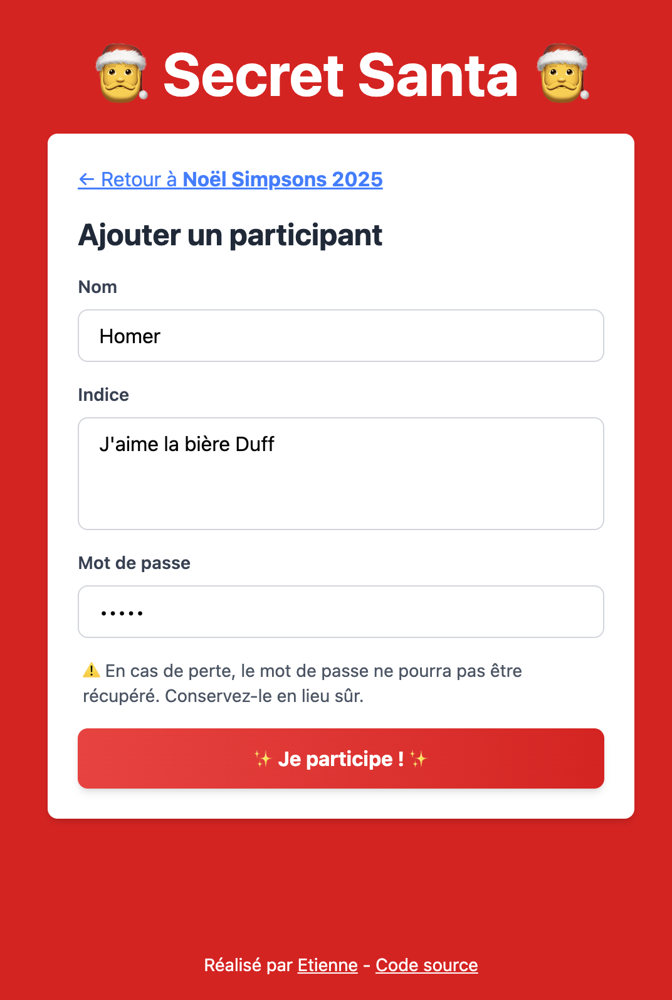
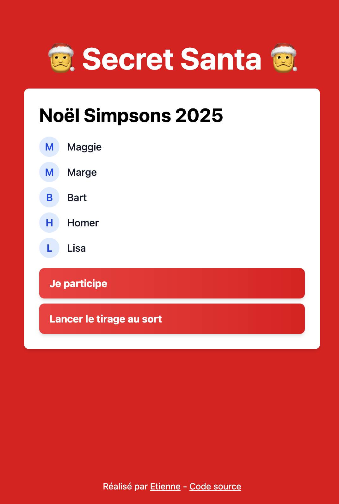
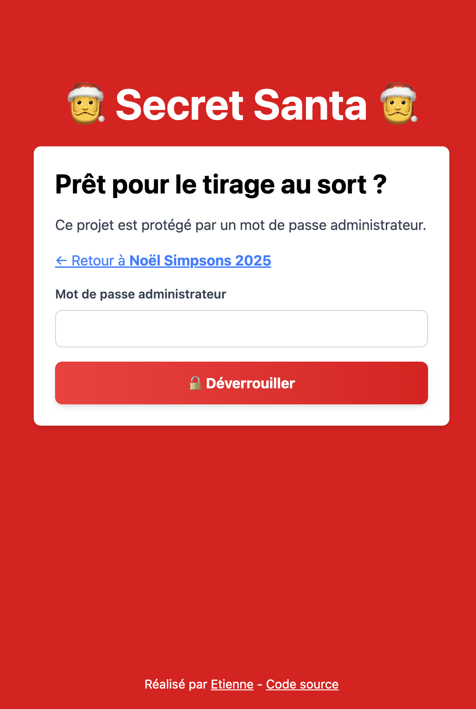
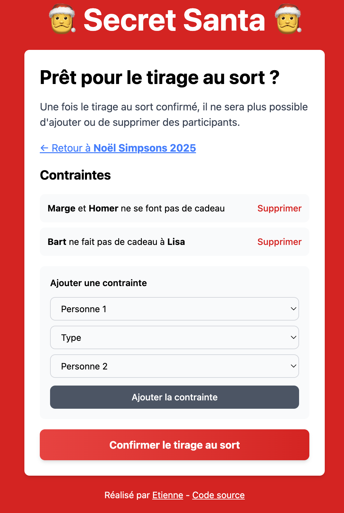
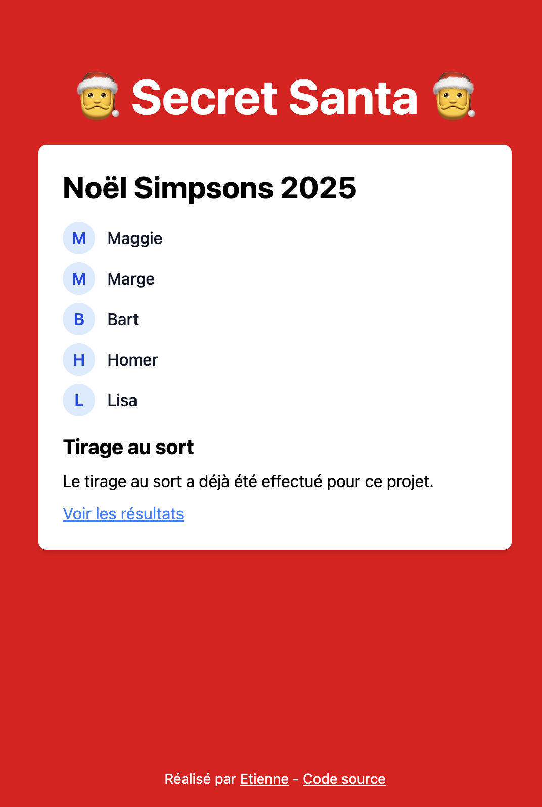
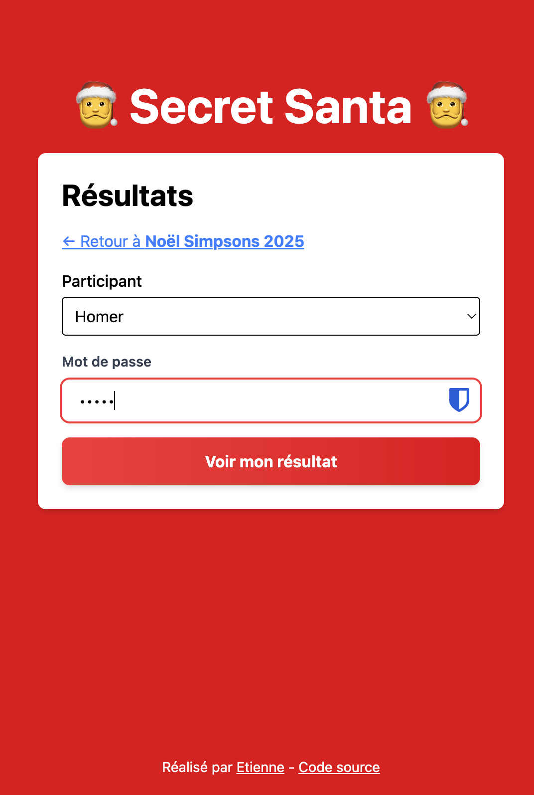
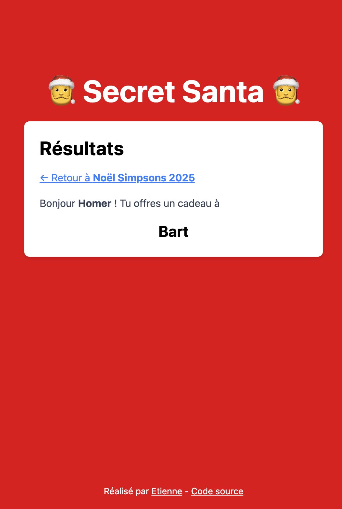

# 🎅 Secret Santa 🎅

A simple web application for organizing Secret Santa gift exchanges, built with Deno and Hono.

[https://🎅.etienne.tech](https://🎅.etienne.tech)

## ✨ How to use

1.  **🎁 Set up your Project:**
    * **Create a new project** by choosing a **Name** (e.g., "Office Party 2025").
    * *Optional:* Add an **Admin Password** to secure settings and the final draw.

2.  **🔗 Invite Participants:**
    * **Share the unique project link** with everyone.
    * Participants register using their **Name** and a **Personal Password** (No email needed!).

3.  **🛡️ Define Rules (If Needed):**
    * *Optional:* As the admin, return to the project to set up **Drawing Constraints** (e.g., preventing specific people or couples from drawing each other).

4.  **🎉 Run the Draw:**
    * Once registration is complete, the admin **runs the draw**. The assignments are now locked in and secret.

5.  **👀 Reveal the Recipient:**
    * Participants can return to the app's project page.
    * They enter the **Personal Password** they used during registration to privately view **who they are buying a gift for.**

## 🎬 Demo for Amel

This section provides a demonstration of the Secret Santa application workflow:

### Quick Start Demo

To see the application in action, follow this example workflow:

1. **Create a Test Project:**
   - Navigate to [https://🎅.etienne.tech](https://🎅.etienne.tech)
   - Create a project named "Demo Project"
   - Set an admin password (e.g., "admin123")

2. **Add Sample Participants:**
   - Add yourself as the first participant
   - Share the project link with test users or add multiple test accounts
   - Each participant should set their own password

3. **Configure Constraints (Optional):**
   - Use the admin password to access settings
   - Add any drawing constraints if needed
   - For example, prevent couples from drawing each other

4. **Execute the Draw:**
   - As admin, trigger the Secret Santa draw
   - Verify the draw is complete and locked

5. **View Results:**
   - Each participant can log in with their personal password
   - They'll see their assigned recipient privately
   - Results remain secure and confidential

### Demo Tips

- Use simple test data to explore all features
- Try different constraint configurations to see how the algorithm works
- Test the password protection features for both admin and participants
- Experience the full workflow from creation to reveal

This demo showcases the simplicity and privacy-focused design of the Secret Santa application!

## Screenshots

<table width="100%">
  <tr>
    <td align="center" width="50%">
      <a href="./screenshots/01-create-project.png"></a>
      <br>
      <strong>1. Create Project</strong>
    </td>
    <td align="center" width="50%">
      <a href="./screenshots/02-add-participant.png"></a>
      <br>
      <strong>2. Add Participant</strong>
    </td>
  </tr>
  <tr>
    <td align="center" width="50%">
      <a href="./screenshots/03-participants-list.png"></a>
      <br>
      <strong>3. Participants List</strong>
    </td>
    <td align="center" width="50%">
      <a href="./screenshots/04-locked.png"></a>
      <br>
      <strong>4. Locked State</strong>
    </td>
  </tr>
  <tr>
    <td align="center" width="50%">
      <a href="./screenshots/05-constraints.png"></a>
      <br>
      <strong>5. Define Constraints</strong>
    </td>
    <td align="center" width="50%">
      <a href="./screenshots/06-draw-done.png"></a>
      <br>
      <strong>6. Draw Done</strong>
    </td>
  </tr>
  <tr>
    <td align="center" width="50%">
      <a href="./screenshots/07-results-lock.png"></a>
      <br>
      <strong>7. Results Lock</strong>
    </td>
    <td align="center" width="50%">
      <a href="./screenshots/08-results.png"></a>
      <br>
      <strong>8. Final Results</strong>
    </td>
  </tr>
</table>

## 🛠️ Technology Stack

- **[Deno](https://deno.land/)**: Modern JavaScript/TypeScript runtime
- **[Hono](https://hono.dev/)**: Fast, lightweight web framework
- **[Deno KV](https://deno.com/kv)**: Built-in key-value database
- **[Tailwind CSS](https://tailwindcss.com/)**: Utility-first CSS framework
- **[Valibot](https://valibot.dev/)**: Schema validation library
- **[bcrypt](https://jsr.io/@felix/bcrypt)**: Secure password hashing

## 📋 Prerequisites

- [Deno](https://deno.land/)

## 🚀 Getting Started

### Installation

1. Clone the repository:
```bash
git clone https://github.com/etienne-dldc/deno-secret-santa.git
cd deno-secret-santa
```

2. Run the application:
```bash
deno task start
```

The application will start on `http://localhost:8000` (or the port specified by Deno).

### Development Mode

For development with hot-reload:
```bash
deno task dev
```

## 🔒 Security & Privacy

- Passwords are hashed using bcrypt before storage
- Each participant can only view their own assignment
- No email addresses or personal information required
- Data is stored securely in Deno KV

## 🌐 Deployment

This application is designed to be deployed on [Deno Deploy](https://deno.com/deploy):

1. Create a Deno Deploy account
2. Link your GitHub repository
3. Deploy with automatic builds on push

The project includes deployment configuration in `deno.json`:
```json
{
  "deploy": {
    "org": "etienne-dldc",
    "app": "deno-secret-santa"
  }
}
```

## 🤝 Contributing

Contributions are welcome! Feel free to open issues or submit pull requests.

## 📄 License

This project is licensed under the MIT License - see the [LICENSE](LICENSE) file for details.

## 👤 Author

**Etienne Dldc**

- GitHub: [@etienne-dldc](https://github.com/etienne-dldc)

## 🙏 Acknowledgments

- Built with ❤️ using Deno
- Icons: Santa emoji 🎅
- Analytics: [Plausible](https://plausible.io) (privacy-friendly)

---

Made with 🎄 for the holiday season!
